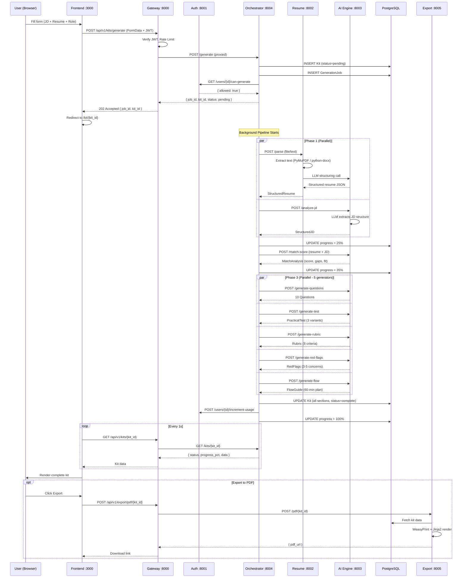

# End-to-End Flow: Generate Interview Kit

> Complete trace of every request, service, and data transformation — from button click to rendered kit.

---

## Table of Contents

- [Architecture Overview](#architecture-overview)
- [Service Map & Ports](#service-map--ports)
- [Complete Flow Diagram](#complete-flow-diagram)
- [Step 1 — User Submits the Form (Frontend)](#step-1--user-submits-the-form-frontend)
- [Step 2 — Gateway Receives Request](#step-2--gateway-receives-request)
- [Step 3 — Kit Orchestrator Initializes Pipeline](#step-3--kit-orchestrator-initializes-pipeline)
- [Step 4 — Background Pipeline Execution (5 Phases)](#step-4--background-pipeline-execution-5-phases)
  - [Phase 1: Parse Resume + Analyze JD (Parallel)](#phase-1-parse-resume--analyze-jd-parallel)
  - [Phase 2: Match Scoring](#phase-2-match-scoring)
  - [Phase 3: Generate All Kit Sections (Parallel)](#phase-3-generate-all-kit-sections-parallel)
  - [Phase 4: Assemble & Store](#phase-4-assemble--store)
- [Step 5 — Frontend Polls for Progress](#step-5--frontend-polls-for-progress)
- [Step 6 — Kit Displayed to User](#step-6--kit-displayed-to-user)
- [Step 7 — Export & Share (Optional)](#step-7--export--share-optional)
- [Database Schema](#database-schema)
- [All API Endpoints Reference](#all-api-endpoints-reference)
- [File Reference Map](#file-reference-map)
- [Approximate Timing](#approximate-timing)

---

## Architecture Overview

The system is a **6-service microservices architecture**. Every external request enters through the **Gateway**, which authenticates, rate-limits, and proxies to the appropriate internal service. The **Kit Orchestrator** is the brain — it coordinates a multi-phase pipeline by calling the **Resume Service** (document parsing) and **AI Engine** (all LLM work), then stores the assembled kit in PostgreSQL.

```
┌─────────────────────────────────────────────────────────────────────────────┐
│                              FRONTEND (Next.js :3000)                       │
│   /generate page  →  /kit/[id] page  →  /dashboard page                   │
└──────────────────────────────┬──────────────────────────────────────────────┘
                               │  HTTP (Axios + JWT)
                               ▼
┌──────────────────────────────────────────────────────────────────────────────┐
│                          GATEWAY (FastAPI :8000)                             │
│   • CORS  • JWT Auth Middleware  • Rate Limiter (Redis)  • Route Proxy      │
└────┬──────────┬──────────────┬──────────────────┬───────────────┬───────────┘
     │          │              │                  │               │
     ▼          ▼              ▼                  ▼               ▼
┌─────────┐ ┌────────┐ ┌──────────────┐ ┌────────────┐ ┌────────────┐
│  AUTH    │ │ RESUME │ │    AI ENGINE  │ │    KIT     │ │   EXPORT   │
│  :8001   │ │ :8002  │ │    :8003     │ │ ORCHESTRATOR│ │   :8005    │
│          │ │        │ │              │ │   :8004     │ │            │
│ Register │ │ PDF    │ │ JD Analyzer  │ │  Pipeline   │ │ PDF Gen    │
│ Login    │ │ DOCX   │ │ Match Scorer │ │  Controller │ │ Share Link │
│ OAuth    │ │ Parser │ │ Question Gen │ │  Progress   │ │            │
│ Quotas   │ │ LLM    │ │ Test Gen     │ │  Tracking   │ │            │
│          │ │ Struct  │ │ Rubric Gen   │ │             │ │            │
│          │ │        │ │ RedFlags Gen │ │             │ │            │
│          │ │        │ │ Flow Gen     │ │             │ │            │
└─────────┘ └────────┘ └──────────────┘ └─────────────┘ └────────────┘
     │          │              │                │               │
     └──────────┴──────────────┴────────────────┴───────────────┘
                               │
                    ┌──────────┴──────────┐
                    │   PostgreSQL + Redis │
                    └─────────────────────┘
```

---

## Service Map & Ports

| Service           | Port  | Role                                               | Talks To                       |
| ----------------- | ----- | -------------------------------------------------- | ------------------------------ |
| **Frontend**      | 3000  | Next.js UI — forms, kit viewer, dashboard          | Gateway only                   |
| **Gateway**       | 8000  | API entry point, auth, rate limiting, proxy routing | Auth, Orchestrator, Export      |
| **Auth**          | 8001  | User registration, login, JWT, usage quotas        | PostgreSQL                     |
| **Resume**        | 8002  | PDF/DOCX parsing, LLM-based resume structuring     | AI Engine (LLM), PostgreSQL    |
| **AI Engine**     | 8003  | All LLM interactions (Claude / GPT-4 / Gemini)     | External LLM APIs              |
| **Kit Orchestrator** | 8004 | Pipeline coordination, progress tracking, storage | Resume, AI Engine, Auth, PostgreSQL |
| **Export**        | 8005  | PDF generation (WeasyPrint), shareable links        | PostgreSQL, file storage       |

---

## Complete Flow Diagram



---

## Step 1 — User Submits the Form (Frontend)

**File:** `frontend/src/app/generate/page.tsx`

The user lands on the `/generate` page and fills out three fields:

| Field         | Type              | Required | Description                                |
| ------------- | ----------------- | -------- | ------------------------------------------ |
| `role_type`   | Select dropdown   | Yes      | e.g. `backend`, `frontend`, `data_scientist`, `ml_engineer`, etc. |
| `jd_text`     | Textarea          | Yes      | Full job description text                  |
| `resume_file` | File input        | Either   | PDF or DOCX file upload                    |
| `resume_text` | Textarea          | Either   | Pasted plain-text resume (alternative)     |

On submit, the frontend constructs a `FormData` object and sends it via the API client:

```typescript
// frontend/src/lib/api-client.ts
// Axios instance with base URL http://localhost:8000/api/v1
// JWT token is attached automatically via request interceptor

const formData = new FormData();
formData.append("jd_text", jobDescription);
formData.append("role_type", roleType);
if (resumeFile) {
  formData.append("resume_file", resumeFile);  // File object
} else {
  formData.append("resume_text", resumeText);  // Plain text
}

const response = await apiClient.post("/kits/generate", formData, {
  headers: { "Content-Type": "multipart/form-data" }
});
// response = { job_id: "uuid", kit_id: "uuid", status: "pending", progress_pct: 0 }
```

**File Upload Component:** `frontend/src/components/file-upload.tsx`
- Drag-and-drop or click-to-browse
- Validates file type (PDF/DOCX only) and size limits
- Shows upload preview with filename

After receiving the response, the frontend **redirects to `/kit/{kit_id}`** to track progress.

---

## Step 2 — Gateway Receives Request

**Files:**
- `backend/gateway/app/main.py` — FastAPI app setup, middleware registration
- `backend/gateway/app/middleware/auth.py` — JWT verification
- `backend/gateway/app/middleware/rate_limiter.py` — Redis-backed rate limiting
- `backend/gateway/app/routes/kits.py` — Kit endpoint with file upload handling

The Gateway is the **only publicly exposed service**. It performs several checks and processes file uploads before proxying:

### 2a. CORS Validation

```python
# backend/gateway/app/main.py
app.add_middleware(
    CORSMiddleware,
    allow_origins=["http://localhost:3000"],
    allow_methods=["*"],
    allow_headers=["*"],
    allow_credentials=True,
)
```

### 2b. JWT Authentication

```python
# backend/gateway/app/middleware/auth.py
# Extracts Bearer token from Authorization header
# Decodes JWT using shared secret
# Attaches user_id to request state
# Rejects with 401 if invalid/expired
```

Public routes (login, register, shared kit links) bypass auth.

### 2c. Rate Limiting

```python
# backend/gateway/app/middleware/rate_limiter.py
# Redis-backed sliding window
# Free tier: 60 requests/minute
# Paid tier: higher limits
# Returns 429 Too Many Requests if exceeded
```

### 2d. File Upload Processing

If the user uploaded a resume file (PDF/DOCX), the Gateway parses it **completely** (extract + structure) before forwarding to the orchestrator:

```python
# backend/gateway/app/routes/kits.py
# POST /api/v1/kits/generate accepts FormData with:
#   - jd_text: str (Form field)
#   - role_type: str (Form field)
#   - resume_file: UploadFile | None (File upload)
#   - resume_text: str | None (Form field)

if resume_file:
    # Call Resume Service to parse the file (extract text + LLM structure)
    async with httpx.AsyncClient() as client:
        files = {"file": (resume_file.filename, file_content, resume_file.content_type)}
        resp = await client.post(
            f"{settings.resume_service_url}/parse",  # http://resume:8002/parse
            files=files,
        )
        parse_result = resp.json()
        parsed_resume_text = parse_result.get("raw_text", "")
        structured_resume_data = parse_result.get("structured_resume")  # Already structured!
```

The Resume Service extracts raw text from the file (using PyMuPDF for PDF or python-docx for DOCX) **AND** structures it with LLM in one call. The Gateway gets both outputs.

### 2e. Proxy to Kit Orchestrator

```python
# Create JSON payload for orchestrator
kit_data = KitGenerateRequest(
    jd_text=jd_text,
    resume_text=parsed_resume_text,
    role_type=role_type,
    structured_resume=structured_resume_data,  # Send pre-structured resume (avoids duplicate LLM call!)
)

# POST to orchestrator with JSON (no longer FormData)
resp = await client.post(
    f"{settings.kit_orchestrator_url}/generate",  # http://orchestrator:8004/generate
    json=kit_data.model_dump(),
    headers={"X-User-ID": user.user_id},
)
```

**Key optimization:** If a file was uploaded, the `structured_resume` is already populated, so the Orchestrator pipeline won't need to call the LLM again!

---

## Step 3 — Kit Orchestrator Initializes Pipeline

**Files:**
- `backend/kit_orchestrator/app/routes/generate.py` — Entry endpoint
- `backend/kit_orchestrator/app/pipeline/controller.py` — Pipeline logic

The Orchestrator is the **coordination brain**. It does NOT do any LLM work itself — it calls other services.

### 3a. Create Database Records

```python
# 1. Create Kit record
kit = Kit(
    user_id=user_id,
    role_type=role_type,
    jd_text=jd_text,
    resume_text=resume_text,  # or None if file
    status="pending"
)
db.add(kit)

# 2. Create GenerationJob for progress tracking
job = GenerationJob(
    kit_id=kit.id,
    user_id=user_id,
    status="pending",
    current_step="initializing",
    progress_pct=0
)
db.add(job)
```

### 3b. Check User Quota

```python
# Call Auth service
response = httpx.get(f"http://auth:8001/users/{user_id}/can-generate")
# Returns { allowed: true/false, remaining: 3, limit: 5 }
# If not allowed → return 403 "Monthly quota exceeded"
```

### 3c. Return Immediately, Spawn Background Task

```python
# Return 202 Accepted right away
# { job_id, kit_id, status: "pending", progress_pct: 0 }

# Spawn async background task
asyncio.create_task(run_pipeline(kit_id, job_id, user_id, jd_text, resume_file, resume_text, role_type, structured_resume))
```

**Why background?** The full pipeline takes 15-35 seconds (LLM calls). The user shouldn't wait — they get redirected to a progress page immediately.

---

## Step 4 — Background Pipeline Execution (5 Phases)

**File:** `backend/kit_orchestrator/app/pipeline/controller.py`

This is the **core of the entire system**. The `run_pipeline()` function executes 4 phases sequentially, with parallelism within phases.

### Phase 1: Parse Resume + Analyze JD (Parallel)

**Progress: 10% → 25%**

These two operations are **independent** and run in parallel via `asyncio.gather()`:

#### 1A. Resume Structuring (Conditional)

**Service:** Resume Service (`:8002`)
**Files:**
- `backend/resume/app/routes/parse.py` — Parse endpoint (extract + structure)
- `backend/resume/app/routes/parse.py` — Structure endpoint (LLM only)
- `backend/resume/app/parser/pdf_parser.py` — PDF text extraction
- `backend/resume/app/parser/docx_parser.py` — DOCX text extraction
- `backend/resume/app/parser/llm_structurer.py` — LLM-based structuring

**OPTIMIZATION:** The Orchestrator checks if `structured_resume` was already provided by the Gateway:

- **If file was uploaded**: Gateway already called `/parse` which extracted text AND structured it with LLM. The Orchestrator receives `structured_resume` and **skips this step entirely** ✅ **NO DUPLICATE LLM CALL**
- **If plain text provided**: Gateway only has raw text. Orchestrator calls `/structure` endpoint to structure it with LLM.

**Request (only if text input, no file):**
```
POST http://resume:8002/structure
Content-Type: application/x-www-form-urlencoded

text=<plain_text_resume>
```

**Internal steps:**

1. **Cache Check**:
   - Compute SHA256 hash of the raw text
   - Look up `_structure_cache` for existing entry
   - If found → return cached `StructuredResume` immediately (skip LLM)

2. **LLM Structuring** (`llm_structurer.py`):
   - Sends raw resume text to LLM with a system prompt:
     > "Extract structured information from this resume. Return JSON matching the schema."
   - Uses the AI Engine's LLM client
   - Parses response into `StructuredResume`

3. **Cache Store**: Save hash + structured data to `_structure_cache`

**Output — `StructuredResume` schema** (`shared/schemas/resume.py`):

```json
{
  "skills": ["Python", "SQL", "TensorFlow", "Machine Learning"],
  "experience_level": "mid",
  "years_of_experience": 4.5,
  "tech_stack": ["TensorFlow", "Spark", "AWS", "Docker"],
  "projects": [
    {
      "name": "Recommendation Engine",
      "description": "Built collaborative filtering model...",
      "technologies": ["Python", "TensorFlow", "Redis"]
    }
  ],
  "education": [
    {
      "degree": "M.S. Computer Science",
      "institution": "Stanford University",
      "year": 2019,
      "score": "3.8 GPA"
    }
  ],
  "employment_timeline": [
    {
      "company": "TechCorp",
      "role": "Data Scientist",
      "duration": "2020-2024",
      "responsibilities": ["Built ML models", "Led team of 3"]
    }
  ],
  "gaps": ["6-month gap between roles in 2022"],
  "summary": "Data scientist with 4.5 years of experience in ML and data pipelines."
}
```

#### 1B. JD Analysis

**Service:** AI Engine (`:8003`)
**Files:**
- `backend/ai_engine/app/routes/analyze.py` — Entry endpoint
- `backend/ai_engine/app/generators/jd_analyzer.py` — LLM prompt + parsing

**Request:**
```
POST http://ai_engine:8003/analyze-jd
Content-Type: application/json

{ "jd_text": "We are looking for a Senior Data Scientist..." }
```

**Internal steps:**

1. `jd_analyzer.py` constructs a prompt asking the LLM to extract structured information from the job description
2. Calls `llm_client.generate_json()` or `llm_client.pydantic_generate()`
3. Returns parsed `StructuredJD`

**Output — `StructuredJD` schema** (`shared/schemas/kit.py`):

```json
{
  "required_skills": ["Python 3+", "SQL", "TensorFlow", "5+ years ML experience"],
  "nice_to_have_skills": ["AWS", "Spark", "Team leadership"],
  "seniority": "senior",
  "responsibilities": [
    "Build and deploy ML models",
    "Lead a team of data scientists",
    "Collaborate with product teams"
  ],
  "team_context": "Reports to VP of Data, team of 6",
  "company_info": "Series B AI startup, 50 employees"
}
```

**After Phase 1:** Orchestrator updates `progress_pct = 25%`, `current_step = "analyzing"`.

---

### Phase 2: Match Scoring

**Progress: 25% → 35%**

**Service:** AI Engine (`:8003`)
**Files:**
- `backend/ai_engine/app/routes/generate.py` — Route
- `backend/ai_engine/app/generators/match_scorer.py` — Scoring logic

**Request:**
```
POST http://ai_engine:8003/match-score
Content-Type: application/json

{
  "structured_resume": { ... },  // from Phase 1A
  "structured_jd": { ... },      // from Phase 1B
  "role_type": "data_scientist"
}
```

**What it does:**
- Sends the full context (resume + JD + role type) to the LLM
- The LLM evaluates how well the candidate matches the role
- Produces a weighted overall score and detailed breakdown

**Output — `MatchAnalysis` schema** (`shared/schemas/kit.py`):

```json
{
  "overall_match_score": 78.5,
  "skill_matches": ["Python", "SQL", "TensorFlow", "Leadership basics"],
  "skill_gaps": ["Spark", "AWS certification", "Advanced Statistics"],
  "experience_fit": "4.5 years as mid-level, but role requires senior. Strong ML background but lacking depth in team leadership and system design at scale.",
  "level_calibration": "underqualified"
}
```

`level_calibration` is one of: `"underqualified"`, `"appropriate"`, `"overqualified"`.

**After Phase 2:** Orchestrator updates `progress_pct = 35%`, `current_step = "scoring"`.

---

### Phase 3: Generate All Kit Sections (Parallel)

**Progress: 35% → 85%**

Five generators run **in parallel** via `asyncio.gather()`. All receive the same context payload:

```python
context = {
    "structured_resume": structured_resume,
    "structured_jd": structured_jd,
    "match_analysis": match_analysis,
    "role_type": role_type
}
```

#### The LLM Client — `backend/ai_engine/app/generators/llm_client.py`

All generators use this shared LLM abstraction:

| Method              | Returns           | Use Case                           |
| ------------------- | ----------------- | ---------------------------------- |
| `generate()`        | Raw string        | Free-form text responses           |
| `generate_json()`   | Parsed dict       | JSON responses with manual parsing |
| `pydantic_generate()` | Validated model | Instructor-based structured output |

**Supported LLM providers:**
- **Claude** (Anthropic) — primary
- **GPT-4** (OpenAI) — fallback
- **Gemini** (Google) — secondary fallback

**Fallback chain:** If the primary LLM fails, it tries the next provider. If all fail, it returns hardcoded fallback data to prevent complete failure.

---

#### Generator 1: Interview Questions

**File:** `backend/ai_engine/app/generators/question_generator.py`
**Endpoint:** `POST /generate-questions`

**Purpose:** Generate 15-20 personalized interview questions tailored to the candidate's profile and the job requirements.

**How it works:**
- Uses `pydantic_generate()` with `QuestionSet` model for reliable structured output
- Deeply analyzes candidate's actual projects, technologies, and employment history
- Cross-references with JD requirements and match analysis insights
- Creates questions across 6 categories: technical_depth, behavioral, system_design, domain_knowledge, problem_solving, and gap_verification
- Each question references specific projects/technologies from the candidate's resume
- Includes relevance rationale explaining why each question matters for this specific candidate

**Output — `list[Question]` (15-20 questions):**

```json
[
  {
    "question": "In your Multi-Agent Physics QA System, you used LangGraph for orchestration. Walk me through a specific challenge you faced with agent coordination and how you resolved it.",
    "category": "technical_depth",
    "what_it_tests": "Deep understanding of LangGraph, practical problem-solving, agent orchestration",
    "model_answer": "Strong answer describes: specific coordination challenge (e.g., state management, routing), solution approach, trade-offs considered, and validation.",
    "follow_up_probes": [
      "How did you debug when agents weren't communicating as expected?",
      "What would you do differently if rebuilding this today?",
      "How did you handle error propagation between agents?"
    ],
    "difficulty": "hard",
    "relevance_rationale": "Candidate claims LangGraph expertise but role requires multi-agent design - verifying depth beyond tutorials"
  },
  {
    "question": "You worked on fraud detection at IDFC First Bank. Describe a specific pattern you identified that indicated fraudulent activity.",
    "category": "domain_knowledge",
    "what_it_tests": "Practical fraud detection experience, pattern recognition, real-world problem-solving",
    "model_answer": "Concrete example: fraud pattern, data points analyzed, threshold determination, false positive handling, business impact.",
    "follow_up_probes": [
      "How did you balance catching fraud vs. customer friction?",
      "What metrics measured effectiveness?",
      "How would you apply this to digital payment fraud?"
    ],
    "difficulty": "medium",
    "relevance_rationale": "Banking fraud experience but role is fintech - assessing transferability"
  }
  // ... 13-18 more questions
]
```

**Question categories:** `technical_depth`, `behavioral`, `system_design`, `domain_knowledge`, `problem_solving`, `gap_verification`
**Difficulty levels:** `easy`, `medium`, `hard`

**Key features:** 
- References specific projects from resume (e.g., "In your Multi-Agent Physics QA System...")
- Uses actual technologies they claim
- Includes `relevance_rationale` field explaining why each question matters
- More comprehensive coverage (15-20 vs 10 questions)

---

#### Generator 2: Practical Test / Skill-Based Technical Assessment

**File:** `backend/ai_engine/app/generators/test_generator.py`
**Endpoint:** `POST /generate-test`

**Purpose:** Generate comprehensive skill-based practical assessments covering 5-8 critical technical skills with progressive difficulty levels.

**How it works:**
- Uses `pydantic_generate()` with `PracticalTestSet` model for structured output
- Analyzes candidate's claimed skills vs JD required skills
- Selects 5-8 most critical technical skills to test
- For each skill, generates 5 progressive questions:
  - 2 Junior level (10-15 min each): Basic syntax, simple implementation
  - 2 Mid level (15-25 min each): Real-world application, optimization, debugging
  - 1 Senior level (25-40 min): Architecture, complex trade-offs, advanced patterns
- Total assessment: 25-40 questions across 5-8 skills, ~2-3 hours

**Internal Structure — `PracticalTestSet`:**

```json
{
  "assessments": [
    {
      "skill_name": "Python",
      "why_this_skill": "Core language for the role; candidate claims 4 years experience; needs verification of depth",
      "questions": [
        {
          "question": "Write a function that takes a list of numbers and returns only the even numbers. Handle edge cases like empty list.",
          "difficulty": "junior",
          "what_it_tests": "Basic syntax, list comprehension/filtering, edge case handling",
          "expected_approach": "Use list comprehension or filter(), validate input type, handle empty list, document edge cases",
          "evaluation_criteria": ["Correct implementation", "Edge case handling", "Code clarity", "Pythonic style"],
          "time_estimate": "10 minutes"
        },
        {
          "question": "Implement a class representing a Bank Account with deposit, withdraw, check_balance methods. Include validation.",
          "difficulty": "junior",
          "what_it_tests": "OOP basics, methods, basic error handling",
          "expected_approach": "Define class with __init__, implement methods with validation, raise appropriate exceptions for invalid operations",
          "evaluation_criteria": ["Correct OOP structure", "Validation logic", "Error handling", "Method documentation"],
          "time_estimate": "15 minutes"
        },
        {
          "question": "Given a CSV with 1M rows, find top 10 most frequent values in a column efficiently. Optimize for memory and speed.",
          "difficulty": "mid",
          "what_it_tests": "File I/O, data processing, performance optimization, pandas vs stdlib choice",
          "expected_approach": "Use pandas or Counter, chunk processing for memory, explain time complexity, benchmark if possible",
          "evaluation_criteria": ["Performance optimization", "Memory efficiency", "Correct use of libraries", "Complexity analysis"],
          "time_estimate": "20 minutes"
        },
        {
          "question": "Debug this code snippet causing a memory leak when processing large files. Identify issue and fix it.",
          "difficulty": "mid",
          "what_it_tests": "Debugging skills, understanding of memory management, generator usage",
          "expected_approach": "Identify the memory leak cause (e.g., loading entire file), use generators, explain the fix",
          "evaluation_criteria": ["Correct diagnosis", "Proper fix", "Understanding of memory", "Use of generators"],
          "time_estimate": "20 minutes"
        },
        {
          "question": "Design a caching decorator supporting TTL (time-to-live), LRU eviction, and thread-safety. Implement core logic.",
          "difficulty": "senior",
          "what_it_tests": "Advanced decorators, concurrency, data structures, design patterns",
          "expected_approach": "Use functools.wraps, OrderedDict or custom structure, threading.Lock, time-based expiration",
          "evaluation_criteria": ["Decorator correctness", "Thread safety", "LRU implementation", "TTL handling", "Edge cases"],
          "time_estimate": "35 minutes"
        }
      ]
    },
    {
      "skill_name": "SQL",
      "why_this_skill": "Required by JD for data analysis; candidate has experience at IDFC Bank",
      "questions": [
        // 5 more SQL questions (2 junior, 2 mid, 1 senior)
      ]
    }
    // ... 3-6 more skills
  ],
  "overall_time_estimate": "2-3 hours",
  "recommended_approach": "Start with skills you're most confident in. Code quality matters more than completion. Document your thought process."
}
```

**Output Format — `PracticalTest` (legacy compatible):**

The structured output is converted to the legacy format with 3 variants:

```json
{
  "title": "Data Scientist - Skill-Based Technical Assessment",
  "overview": "Comprehensive technical assessment covering 6 critical skills: Python, SQL, Machine Learning, Pandas, System Design, Statistics.\\n\\nThis assessment contains 6 skill-based sections with progressive difficulty levels.\\nTotal time: 2-3 hours.",
  "variants": [
    {
      "difficulty": "junior",
      "task_description": "**Python** (2 questions):\\n1. Write a function that takes a list of numbers...\\n   Time: 10 minutes | Tests: Basic syntax, list comprehension\\n2. Implement a Bank Account class...\\n   Time: 15 minutes | Tests: OOP basics\\n\\n**SQL** (2 questions):\\n...",
      "expected_deliverables": ["Solutions for all junior-level questions", "Clean, well-commented code"],
      "time_limit": "45-60 minutes",
      "evaluation_criteria": ["Code correctness", "Edge case handling", "Code clarity", ...]
    },
    {
      "difficulty": "mid",
      "task_description": "**Python** (2 questions):\\n1. Find top 10 values in 1M row CSV efficiently...\\n...",
      "time_limit": "60-90 minutes",
      "evaluation_criteria": ["Performance optimization", "Debugging approach", ...]
    },
    {
      "difficulty": "senior",
      "task_description": "**Python** (1 question):\\n1. Design a caching decorator with TTL, LRU, thread-safety...\\n...",
      "time_limit": "60-90 minutes",
      "evaluation_criteria": ["System design thinking", "Advanced patterns", ...]
    }
  ]
}
```

**Key features:**
- Skill-based organization (5-8 skills, 5 questions each)
- Progressive difficulty per skill
- Specific to candidate's claimed expertise
- Clear evaluation criteria for each question
- Total: 25-40 questions, 2-3 hours
```

---

#### Generator 3: Scoring Rubric

**File:** `backend/ai_engine/app/generators/rubric_generator.py`
**Endpoint:** `POST /generate-rubric`

**Purpose:** Create a weighted scoring framework so interviewers evaluate candidates consistently.

**Output — `Rubric`:**

```json
{
  "criteria": [
    {
      "name": "Technical Skills",
      "weight_pct": 25,
      "description": "Core technical competency in required technologies",
      "score_1": "Cannot explain basic concepts; no hands-on experience",
      "score_3": "Solid understanding; can solve standard problems independently",
      "score_5": "Expert-level depth; can architect solutions and mentor others"
    },
    {
      "name": "Problem Solving",
      "weight_pct": 20,
      "description": "Ability to break down complex problems and find solutions",
      "score_1": "Struggles to approach unfamiliar problems",
      "score_3": "Systematic approach; reaches reasonable solutions",
      "score_5": "Elegant solutions; considers edge cases and tradeoffs proactively"
    },
    {
      "name": "Communication",
      "weight_pct": 15,
      "description": "Clarity in explaining technical concepts",
      "score_1": "Unclear, disorganized responses",
      "score_3": "Clear explanations with reasonable structure",
      "score_5": "Exceptional clarity; adapts explanation to audience level"
    }
    // ... more criteria (typically 6-8 total)
  ],
  "pass_threshold": 3.0,
  "total_weight": 100
}
```

---

#### Generator 4: Red Flags & Probes

**File:** `backend/ai_engine/app/generators/red_flags_generator.py`
**Endpoint:** `POST /generate-red-flags`

**Purpose:** Identify potential concerns in the candidate's background and provide tactful probe questions.

**Output — `list[RedFlag]`:**

```json
[
  {
    "concern": "6-month employment gap between TechCorp and DataInc (Jan–Jun 2022)",
    "severity": "medium",
    "probe_question": "I noticed a transition period between your roles in 2022. Could you walk me through what you were focused on during that time?",
    "what_to_listen_for": "Clear explanation — career break, learning, health, or personal reasons are all fine. Watch for evasiveness or inconsistency with other answers."
  },
  {
    "concern": "No experience with Spark despite it being a required skill",
    "severity": "high",
    "probe_question": "The role involves significant Spark work. What's your experience with distributed computing frameworks?",
    "what_to_listen_for": "Willingness to learn, adjacent experience (e.g., Dask, Hadoop), or a concrete ramp-up plan. Red flag if they dismiss the gap."
  },
  {
    "concern": "Short tenure at previous company (8 months)",
    "severity": "low",
    "probe_question": "Tell me about your decision to move from DataInc after 8 months.",
    "what_to_listen_for": "Reasonable explanation — team restructuring, misaligned expectations, or better opportunity. Pattern of short stays would be more concerning."
  }
]
```

**Severity levels:** `low`, `medium`, `high`

---

#### Generator 5: Interview Flow Guide

**File:** `backend/ai_engine/app/generators/flow_generator.py`
**Endpoint:** `POST /generate-flow`

**Purpose:** Create a structured 60-minute interview plan mapping questions to time blocks.

**Output — `list[FlowSection]`:**

```json
[
  {
    "section": "Introduction & Rapport Building",
    "duration_minutes": 5,
    "activities": [
      "Welcome the candidate",
      "Introduce yourself and the team",
      "Explain interview format and timeline",
      "Ask an icebreaker question"
    ],
    "questions_mapped": []
  },
  {
    "section": "Background & Career Journey",
    "duration_minutes": 10,
    "activities": [
      "Walk through career trajectory",
      "Clarify role transitions and motivations",
      "Probe employment gaps if any"
    ],
    "questions_mapped": [0, 1]
  },
  {
    "section": "Technical Deep-Dive",
    "duration_minutes": 20,
    "activities": [
      "Core technical questions",
      "Follow-up probes based on responses",
      "Assess problem-solving approach"
    ],
    "questions_mapped": [2, 3, 4, 5]
  },
  {
    "section": "Behavioral & Situational",
    "duration_minutes": 10,
    "activities": [
      "Leadership and collaboration scenarios",
      "Conflict resolution",
      "Culture fit assessment"
    ],
    "questions_mapped": [6, 7]
  },
  {
    "section": "Candidate Questions & Close",
    "duration_minutes": 10,
    "activities": [
      "Open floor for candidate questions",
      "Discuss next steps and timeline",
      "Thank the candidate"
    ],
    "questions_mapped": [8, 9]
  },
  {
    "section": "Post-Interview Scoring",
    "duration_minutes": 5,
    "activities": [
      "Complete rubric scoring immediately",
      "Note key observations",
      "Flag any red flags observed"
    ],
    "questions_mapped": []
  }
]
```

`questions_mapped` contains indices into the questions array (Generator 1), linking the flow to specific questions.

**After Phase 3:** Orchestrator updates `progress_pct = 85%`, `current_step = "generating_kit_sections"`.

---

### Phase 4: Assemble & Store

**Progress: 85% → 100%**

Back in `backend/kit_orchestrator/app/pipeline/controller.py`:

```python
# Update Kit with all generated content
kit.structured_resume = structured_resume
kit.structured_jd = structured_jd
kit.match_analysis = match_analysis
kit.questions = questions
kit.practical_test = practical_test
kit.rubric = rubric
kit.red_flags = red_flags
kit.flow_guide = flow_guide
kit.title = f"{structured_jd.seniority} {role_type} Interview Kit"
kit.status = "complete"   # or "partial" if some generators failed
db.commit()

# Increment user's monthly usage counter
httpx.post(f"http://auth:8001/users/{user_id}/increment-usage")

# Update job progress
job.progress_pct = 100
job.status = "complete"
job.current_step = "done"
job.completed_at = datetime.utcnow()
db.commit()
```

**Error handling:**
- If individual generators fail, remaining generators still run
- Kit status is set to `"partial"` with available sections
- `GenerationJob.error_message` stores failure details
- If the entire pipeline crashes, status becomes `"failed"`

---

## Step 5 — Frontend Polls for Progress

**File:** `frontend/src/app/kit/[id]/page.tsx`

After redirect to `/kit/{kit_id}`, the frontend tracks progress in two ways:

### Polling (Primary)

```typescript
// Poll every 1 second
const interval = setInterval(async () => {
  const response = await apiClient.get(`/kits/${kitId}`);
  setProgress(response.data.progress_pct);
  setStatus(response.data.status);

  if (response.data.status === "complete" || response.data.status === "failed") {
    clearInterval(interval);
    setKit(response.data);
  }
}, 1000);
```

### SSE Stream (Real-time alternative)

```typescript
// Server-Sent Events for real-time updates
const eventSource = new EventSource(`/api/v1/kits/${kitId}/stream`);
eventSource.onmessage = (event) => {
  const data = JSON.parse(event.data);
  setProgress(data.progress_pct);
  setCurrentStep(data.current_step);
};
```

**Request flow for each poll:**
```
Frontend → GET /api/v1/kits/{kit_id}
  → Gateway (auth check)
    → GET http://orchestrator:8004/kits/{kit_id}
      → PostgreSQL query
    ← Kit data + progress
  ← Response
← Display progress bar + current step
```

**Progress states the user sees:**

| Progress | `current_step`              | User-Facing Text                   |
| -------- | --------------------------- | ---------------------------------- |
| 0%       | `initializing`              | "Setting up..."                    |
| 10%      | `parsing_resume`            | "Parsing your resume..."           |
| 25%      | `analyzing`                 | "Analyzing job description..."     |
| 35%      | `scoring`                   | "Computing match score..."         |
| 35-85%   | `generating_kit_sections`   | "Generating interview kit..."      |
| 100%     | `done`                      | "Kit ready!"                       |

---

## Step 6 — Kit Displayed to User

**File:** `frontend/src/components/kit-viewer.tsx`

Once `status === "complete"`, the KitViewer component renders all 7 sections:

### Section Layout

```
┌─────────────────────────────────────────────────────┐
│                    KIT HEADER                        │
│  "Senior Data Scientist Interview Kit"               │
│  Match Score: 78/100  ██████████░░  Role: DS         │
│  [Export PDF]  [Share Link]  [Delete]                 │
├─────────────────────────────────────────────────────┤
│                                                      │
│  ① MATCH ANALYSIS                                    │
│  ├── Overall Score: 78.5 / 100                       │
│  ├── Matched Skills: Python, SQL, TensorFlow         │
│  ├── Skill Gaps: Spark, AWS, Advanced Stats          │
│  ├── Experience Fit: Mid-level, role needs senior     │
│  └── Calibration: Slightly Underqualified            │
│                                                      │
│  ② INTERVIEW QUESTIONS (10)                          │
│  ├── [Q1] Walk me through an ML project... [medium]  │
│  │   ├── Tests: E2E thinking, communication          │
│  │   ├── Model Answer: ...                           │
│  │   └── Follow-ups: 3 probes                        │
│  ├── [Q2] How would you handle... [hard]             │
│  └── ... (collapsible)                               │
│                                                      │
│  ③ PRACTICAL ASSESSMENT                              │
│  ├── Junior variant: Basic EDA + model (2hr)         │
│  ├── Mid variant: Full pipeline + tuning (4hr)       │
│  └── Senior variant: Production system (8hr)         │
│                                                      │
│  ④ SCORING RUBRIC                                    │
│  ├── Technical Skills (25%) - 1/3/5 descriptions     │
│  ├── Problem Solving (20%) - 1/3/5 descriptions      │
│  ├── Communication (15%) - 1/3/5 descriptions        │
│  └── Pass threshold: 3.0                             │
│                                                      │
│  ⑤ RED FLAGS & PROBES                                │
│  ├── [HIGH] No Spark experience                      │
│  │   └── Probe: "What's your experience with..."     │
│  ├── [MEDIUM] Employment gap 2022                    │
│  │   └── Probe: "Walk me through that period..."     │
│  └── [LOW] Short tenure at DataInc                   │
│                                                      │
│  ⑥ INTERVIEW FLOW (60 min)                           │
│  ├── 0-5min:  Introduction                           │
│  ├── 5-15min: Background (Q1, Q2)                    │
│  ├── 15-35min: Technical Deep-Dive (Q3-Q6)           │
│  ├── 35-45min: Behavioral (Q7, Q8)                   │
│  ├── 45-55min: Candidate Questions (Q9, Q10)         │
│  └── 55-60min: Post-Interview Scoring                │
│                                                      │
└─────────────────────────────────────────────────────┘
```

---

## Step 7 — Export & Share (Optional)

### PDF Export

**Files:**
- `backend/export/app/routes/pdf.py` — PDF generation endpoint
- `backend/export/app/templates/` — Jinja2 HTML templates

**Flow:**
```
Frontend: POST /api/v1/export/pdf/{kit_id}
  → Gateway → Export Service (:8005)
    → Fetch kit data from PostgreSQL
    → Render Jinja2 HTML template with kit data
    → Convert HTML to PDF via WeasyPrint
    → Store PDF to disk (data/exports/)
    → Return { pdf_url: "/api/v1/export/download/{kit_id}" }
  ← Frontend opens download link
```

### Share Link

**File:** `backend/export/app/routes/share.py`

```
Frontend: POST /api/v1/export/share/{kit_id}
  → Gateway → Export Service
    → Generate unique share_token (UUID)
    → Store share_token on Kit record
    → Return { share_url: "https://app.com/shared/{share_token}" }

Anyone with the link:
  GET /api/v1/export/shared/{share_token}
    → Gateway (NO auth required — public route)
      → Orchestrator: GET /shared/{share_token}
        → PostgreSQL lookup by share_token
      ← Kit data (read-only)
    ← Render kit in read-only mode
```

---

## Database Schema

**File:** `shared/database/models.py`  
**Init script:** `scripts/init_db.sql`

### `users` Table

| Column                      | Type         | Description                       |
| --------------------------- | ------------ | --------------------------------- |
| `id`                        | UUID (PK)    | Unique user identifier            |
| `email`                     | VARCHAR      | Unique email address              |
| `password_hash`             | VARCHAR      | bcrypt hashed password            |
| `plan`                      | VARCHAR      | `"free"` or `"pro"`              |
| `kits_generated_this_month` | INTEGER      | Monthly usage counter             |
| `created_at`                | TIMESTAMP    | Account creation time             |

### `kits` Table

| Column              | Type         | Description                                |
| ------------------- | ------------ | ------------------------------------------ |
| `id`                | UUID (PK)    | Unique kit identifier                      |
| `user_id`           | UUID (FK)    | Owner user reference                       |
| `title`             | VARCHAR      | Auto-generated title                       |
| `role_type`         | VARCHAR      | e.g. `data_scientist`                      |
| `status`            | VARCHAR      | `pending`, `generating`, `complete`, `partial`, `failed` |
| `jd_text`           | TEXT         | Raw job description                        |
| `resume_text`       | TEXT         | Raw resume text                            |
| `structured_resume` | JSONB        | Parsed resume (StructuredResume)           |
| `structured_jd`     | JSONB        | Parsed JD (StructuredJD)                   |
| `match_analysis`    | JSONB        | Match scoring results (MatchAnalysis)      |
| `questions`         | JSONB        | Generated questions (list[Question])       |
| `practical_test`    | JSONB        | Take-home test (PracticalTest)             |
| `rubric`            | JSONB        | Scoring rubric (Rubric)                    |
| `red_flags`         | JSONB        | Red flags & probes (list[RedFlag])         |
| `flow_guide`        | JSONB        | Interview flow (list[FlowSection])         |
| `pdf_url`           | VARCHAR      | Generated PDF path (nullable)              |
| `share_token`       | VARCHAR      | Unique share link token (nullable)         |
| `created_at`        | TIMESTAMP    | Kit creation time                          |

### `generation_jobs` Table

| Column          | Type         | Description                               |
| --------------- | ------------ | ----------------------------------------- |
| `id`            | UUID (PK)    | Unique job identifier                     |
| `kit_id`        | UUID (FK)    | Associated kit                            |
| `user_id`       | UUID (FK)    | User who triggered                        |
| `status`        | VARCHAR      | `pending`, `running`, `complete`, `failed`|
| `current_step`  | VARCHAR      | Current pipeline phase name               |
| `progress_pct`  | INTEGER      | 0-100 progress percentage                 |
| `error_message` | TEXT         | Error details if failed                   |
| `started_at`    | TIMESTAMP    | Pipeline start time                       |
| `completed_at`  | TIMESTAMP    | Pipeline completion time                  |

### `parsed_resumes` Table (Cache)

| Column          | Type         | Description                               |
| --------------- | ------------ | ----------------------------------------- |
| `id`            | UUID (PK)    | Unique identifier                         |
| `file_hash`     | VARCHAR      | SHA256 of raw text (unique index)         |
| `raw_text`      | TEXT         | Extracted plain text                      |
| `structured_data`| JSONB       | Cached StructuredResume                   |

---

## All API Endpoints Reference

### Gateway — Public Routes (`:8000`)

| Method | Path                                 | Auth? | Proxies To          | Purpose                       |
| ------ | ------------------------------------ | ----- | -------------------- | ----------------------------- |
| POST   | `/api/v1/auth/register`              | No    | Auth `:8001`         | Create new account            |
| POST   | `/api/v1/auth/login`                 | No    | Auth `:8001`         | Login, get JWT                |
| POST   | `/api/v1/auth/google`                | No    | Auth `:8001`         | Google OAuth login            |
| POST   | `/api/v1/kits/generate`              | Yes   | Orchestrator `:8004` | Start kit generation          |
| GET    | `/api/v1/kits`                       | Yes   | Orchestrator `:8004` | List user's kits (paginated)  |
| GET    | `/api/v1/kits/{kit_id}`              | Yes   | Orchestrator `:8004` | Get kit details + progress    |
| DELETE | `/api/v1/kits/{kit_id}`              | Yes   | Orchestrator `:8004` | Delete a kit                  |
| GET    | `/api/v1/kits/{kit_id}/stream`       | Yes   | Orchestrator `:8004` | SSE progress stream           |
| POST   | `/api/v1/export/pdf/{kit_id}`        | Yes   | Export `:8005`       | Generate PDF                  |
| GET    | `/api/v1/export/download/{kit_id}`   | Yes   | Export `:8005`       | Download PDF                  |
| GET    | `/api/v1/export/shared/{token}`      | No    | Orchestrator `:8004` | View shared kit (public)      |

### Auth Service — Internal (`:8001`)

| Method | Path                               | Purpose                             |
| ------ | ---------------------------------- | ----------------------------------- |
| POST   | `/register`                        | Create user, hash password, return JWT |
| POST   | `/login`                           | Verify credentials, return JWT      |
| POST   | `/oauth/google`                    | Verify Google token, upsert user    |
| GET    | `/users/{user_id}`                 | Get user profile                    |
| GET    | `/users/{user_id}/can-generate`    | Check monthly quota                 |
| POST   | `/users/{user_id}/increment-usage` | Increment monthly counter           |

### Resume Service — Internal (`:8002`)

| Method | Path         | Purpose                                       |
| ------ | ------------ | --------------------------------------------- |
| POST   | `/parse`     | Accept file → extract text + structure with LLM → return both |
| POST   | `/extract`   | Accept file → extract text only (no LLM)      |
| POST   | `/structure` | Accept text → structure with LLM → return StructuredResume |

### AI Engine — Internal (`:8003`)

| Method | Path                  | Purpose                                 |
| ------ | --------------------- | --------------------------------------- |
| POST   | `/analyze-jd`         | Extract StructuredJD from raw text      |
| POST   | `/match-score`        | Compute MatchAnalysis from resume + JD  |
| POST   | `/generate-questions` | Generate 10 interview questions         |
| POST   | `/generate-test`      | Generate practical test (3 variants)    |
| POST   | `/generate-rubric`    | Generate scoring rubric                 |
| POST   | `/generate-red-flags` | Generate red flags + probe questions    |
| POST   | `/generate-flow`      | Generate 60-min interview flow          |

### Kit Orchestrator — Internal (`:8004`)

| Method | Path                       | Purpose                              |
| ------ | -------------------------- | ------------------------------------ |
| POST   | `/generate`                | Initialize pipeline + spawn background task |
| GET    | `/kits/{kit_id}`           | Get kit with all data                |
| GET    | `/kits`                    | List kits for a user (paginated)     |
| DELETE | `/kits/{kit_id}`           | Soft-delete a kit                    |
| GET    | `/kits/{kit_id}/stream`    | SSE progress updates                 |
| GET    | `/shared/{share_token}`    | Public kit access via share token    |

### Export Service — Internal (`:8005`)

| Method | Path                  | Purpose                              |
| ------ | --------------------- | ------------------------------------ |
| POST   | `/pdf/{kit_id}`       | Generate PDF from kit data           |
| GET    | `/download/{kit_id}`  | Serve PDF file                       |
| POST   | `/share/{kit_id}`     | Create shareable link (share_token)  |

---

## File Reference Map

### Frontend

| File                                         | Purpose                                    |
| -------------------------------------------- | ------------------------------------------ |
| `frontend/src/app/generate/page.tsx`         | Kit generation form (JD + Resume + Role)   |
| `frontend/src/app/kit/[id]/page.tsx`         | Kit viewer with real-time progress polling  |
| `frontend/src/app/dashboard/page.tsx`        | User's kit history list                    |
| `frontend/src/app/login/page.tsx`            | Login / registration page                  |
| `frontend/src/components/file-upload.tsx`    | Drag-and-drop file upload component        |
| `frontend/src/components/kit-viewer.tsx`     | Full kit display with all 7 sections       |
| `frontend/src/lib/api-client.ts`            | Axios instance with JWT interceptor        |
| `frontend/src/types/index.ts`               | TypeScript interfaces for all data models  |

### Backend — Gateway

| File                                               | Purpose                               |
| -------------------------------------------------- | ------------------------------------- |
| `backend/gateway/app/main.py`                      | FastAPI app, CORS, middleware setup    |
| `backend/gateway/app/config.py`                    | Service URLs, secrets, settings       |
| `backend/gateway/app/routes/kits.py`               | Kit endpoints (proxy to orchestrator) |
| `backend/gateway/app/middleware/auth.py`            | JWT verification middleware           |
| `backend/gateway/app/middleware/rate_limiter.py`    | Redis-backed rate limiter             |

### Backend — Kit Orchestrator

| File                                                      | Purpose                                   |
| --------------------------------------------------------- | ----------------------------------------- |
| `backend/kit_orchestrator/app/main.py`                    | FastAPI app setup                         |
| `backend/kit_orchestrator/app/routes/generate.py`         | Pipeline entry endpoint                   |
| `backend/kit_orchestrator/app/pipeline/controller.py`     | **CORE** — all pipeline phases & coordination |

### Backend — AI Engine

| File                                                        | Purpose                                  |
| ----------------------------------------------------------- | ---------------------------------------- |
| `backend/ai_engine/app/main.py`                            | FastAPI app setup                        |
| `backend/ai_engine/app/routes/analyze.py`                  | JD analysis endpoint                     |
| `backend/ai_engine/app/routes/generate.py`                 | All generation endpoints                 |
| `backend/ai_engine/app/generators/llm_client.py`           | LLM abstraction (Claude/GPT-4/Gemini)   |
| `backend/ai_engine/app/generators/jd_analyzer.py`          | JD → StructuredJD                        |
| `backend/ai_engine/app/generators/match_scorer.py`         | Resume + JD → MatchAnalysis              |
| `backend/ai_engine/app/generators/question_generator.py`   | Context → 10 Questions                   |
| `backend/ai_engine/app/generators/test_generator.py`       | Context → PracticalTest (3 variants)     |
| `backend/ai_engine/app/generators/rubric_generator.py`     | Context → Rubric (scoring criteria)      |
| `backend/ai_engine/app/generators/red_flags_generator.py`  | Context → RedFlags + probes              |
| `backend/ai_engine/app/generators/flow_generator.py`       | Context → 60-min Interview Flow          |

### Backend — Resume Service

| File                                                | Purpose                              |
| --------------------------------------------------- | ------------------------------------ |
| `backend/resume/app/main.py`                        | FastAPI app setup                    |
| `backend/resume/app/routes/parse.py`                | Resume parse endpoint                |
| `backend/resume/app/parser/pdf_parser.py`           | PyMuPDF-based PDF text extraction    |
| `backend/resume/app/parser/docx_parser.py`          | python-docx DOCX text extraction     |
| `backend/resume/app/parser/llm_structurer.py`       | LLM-based resume structuring         |

### Backend — Auth Service

| File                                        | Purpose                              |
| ------------------------------------------- | ------------------------------------ |
| `backend/auth/app/main.py`                  | FastAPI app setup                    |
| `backend/auth/app/routes/auth.py`           | Register, login, OAuth endpoints     |
| `backend/auth/app/routes/users.py`          | User profile, quota management       |
| `backend/auth/app/services/password.py`     | bcrypt password hashing              |

### Backend — Export Service

| File                                        | Purpose                              |
| ------------------------------------------- | ------------------------------------ |
| `backend/export/app/main.py`                | FastAPI app setup                    |
| `backend/export/app/routes/pdf.py`          | PDF generation (WeasyPrint + Jinja2) |
| `backend/export/app/routes/share.py`        | Share link creation                  |

### Shared

| File                          | Purpose                                          |
| ----------------------------- | ------------------------------------------------ |
| `shared/database/models.py`   | SQLAlchemy ORM models (users, kits, jobs, cache) |
| `shared/schemas/kit.py`       | Pydantic schemas: Kit, Question, Rubric, etc.    |
| `shared/schemas/resume.py`    | Pydantic schemas: StructuredResume, Education, etc. |
| `shared/schemas/auth.py`      | Pydantic schemas: User, Token                    |
| `shared/schemas/common.py`    | Shared base schemas                              |
| `shared/config/__init__.py`   | Base settings (DB URL, Redis, secrets)            |

### Infrastructure

| File                  | Purpose                                         |
| --------------------- | ----------------------------------------------- |
| `docker-compose.yml`  | All 6 services + PostgreSQL + Redis containers  |
| `Makefile`            | Dev commands (`make up`, `make build`, etc.)     |
| `scripts/run_all.sh`  | Local development startup (no Docker)            |
| `scripts/init_db.sql` | Database schema initialization                   |

---

## Approximate Timing

| Phase                              | Duration     | Bottleneck                |
| ---------------------------------- | ------------ | ------------------------- |
| Frontend → Gateway → Orchestrator  | ~200ms       | Network + auth            |
| Phase 1: Resume Parse              | 1-3s         | LLM call for structuring  |
| Phase 1: JD Analysis               | 2-5s         | LLM call                  |
| Phase 2: Match Scoring             | 1-3s         | LLM call                  |
| Phase 3: 5 Generators (parallel)   | 5-15s        | Slowest LLM call          |
| Phase 4: Assembly + DB write       | ~500ms       | DB write                  |
| **Total pipeline**                 | **15-35s**   | LLM response time         |
| PDF Export (on demand)             | 5-10s        | HTML render + PDF convert |
